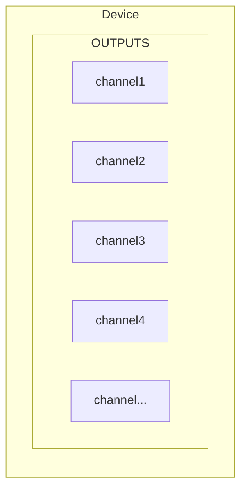
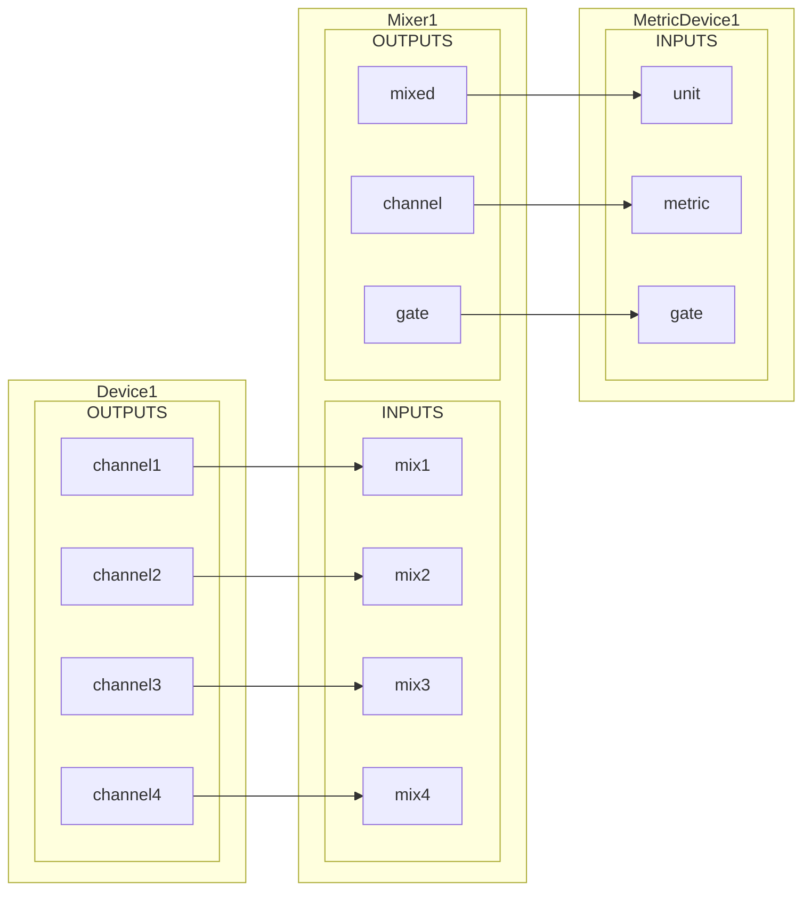
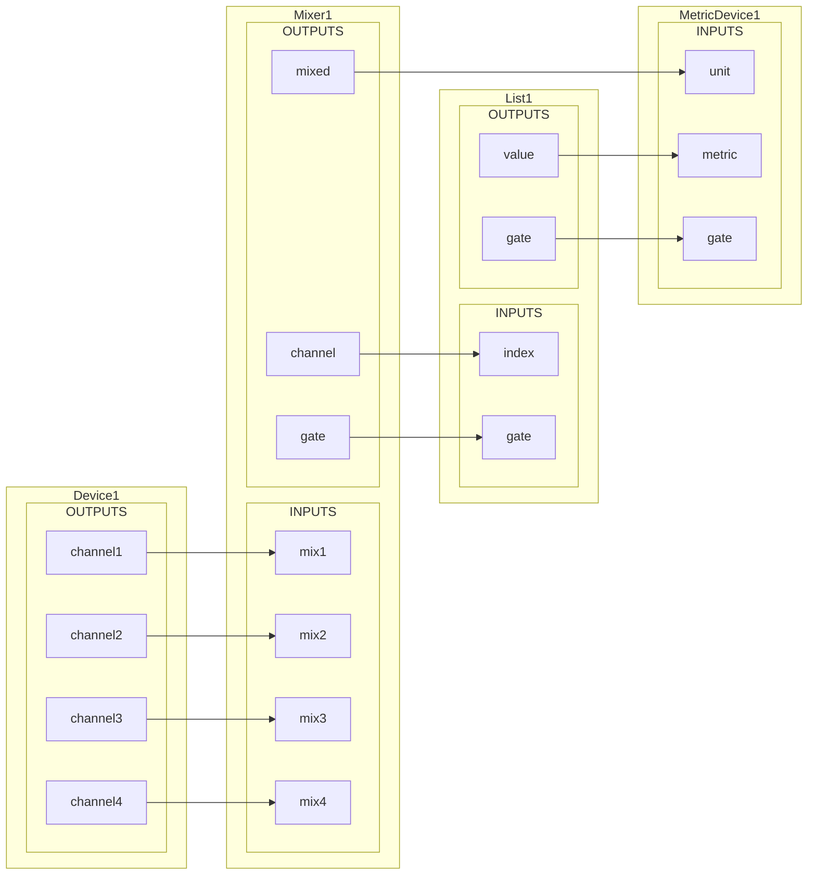

# basic

Базовый набор устройств для vrack2

# Установка

Заходим в папку с устройствами

``` 
cd /opt/vrack2-service/devices
```

Клонируем репозиторий

```
git clone https://gitlab.com/vrack2/vrack2-basic.git
```

Не имеет зависимостей

- [basic](#basic)
- [Установка](#установка)
- [Общее поведение](#общее-поведение)
  - [Основные рекомендации](#основные-рекомендации)
  - [Типы данных портов устройств](#типы-данных-портов-устройств)
  - [Правила входов/выходов](#правила-входоввыходов)
    - [Правила `gate`](#правила-gate)

Общее поведение
===============

Базовый набор содержит простые устройства которые могут помочь с построением простых схем. Данный набор пропагандирует основные рекомендации создания собственных устройств для VRack.

## Типы данных портов устройств

Что бы соединить два устройства, необязательно, что бы типы данных соответсвующих портов были одинаковы. Базовый набор устройств рекомендует следующие типы данных:

 - **mixed** - Любой типа данных, обычно используется в микшерах, когда типа входящих данных не имеет значения
 - **number** - обычно имеет тип данных числа, может быть с плавающей точкой
 - **signal** - тип данных не имеет значение, обычно используется для передачи факта сигнала, по умолчанию обычно равняется (1)

Основная проблема передачи объекта по связи - прием таких данных нельзя стандартизировать в широком спектре. 

Например, наше устройство шлет объект, где `channel` номер канала а `value` значение

```js
{
    channel: 10,
    value: 2
}
```

В таком формате нет ничего плохого. Но, к сожалению, мы не можем простым способом отделить значение одного канала от другого.

Отсюда следует вывод, что нужно по возможности разделить выходы на отдельные, для каждого канала.

Вот как мы представим наше устройство



Если выходов много, становится неудобно с этими выходами работать. Для агрегации выходов нам может помочь микшер каналов.

Когда на вход микшера приходят данные, он генерирует на выходе последовательно 3 сигнала: 

* **mixed** *mixed* - Значение которое поступило на вход (тип значения любой)
* **channel** *number* - Номер канала
* **gate** *signal* - Завершение передачи

Тип **signal** не определяет конкретного типа значения, сигнал для устройства, это условный сигнал для начала выполнения работы, обычно его определяют, как порт `gate`. По умолчанию значение для канала `gate` - `1` (числовая единица).

В базовом наборе есть микшер `basic.Mixer` с неограниченым набором входов



Теперь мы можем отделять данные друг от друга и модифицировать их перед отправкой в общий поток.

Например, мы можем модифицировать только занчение каналов используя `basic.List`.

Устройство `basic.List` работает как ассоциативный массив, принимая на входе значение и подменяя его на выходе:



## Правила входов/выходов

Если устройство использует несколько выходов для передачи данных, которые регистрируются с помощью входа `gate`, оно **обязано** передавать их последовательно, не используюя асинхронные методы или задежки между передачами, обязательно заканчивая отправкой сигнала `gate`.

```js
// выше идет подготовка данных
this.outputs.value.push(value)
this.outputs.channel.push(channel)
this.outputs.gate.push(this.gate)
```

### Правила `gate`

Порт `gate` или сигнальный порт, имеет определенные требования, что бы все устройста имеющие этот порт работали предсказуемо

 1. Устройство, которое имеет `gate` на входе, обязано иметь его и на выходе
 2. Вход `gate` всегда передает на выход значение приходящего `gate`
 3. Если устройство может обработать данные одного канала, `gate` для нее становится не обязательным. Как пример можно привести [Aggregate](#aggregate) - если `gate` не подключен, то `gate` и `channel` не будут учитываться и все приходящие данные будут считаться, как данные единственного канала (по умолчанию `1` для `gate` и `channel` ).
